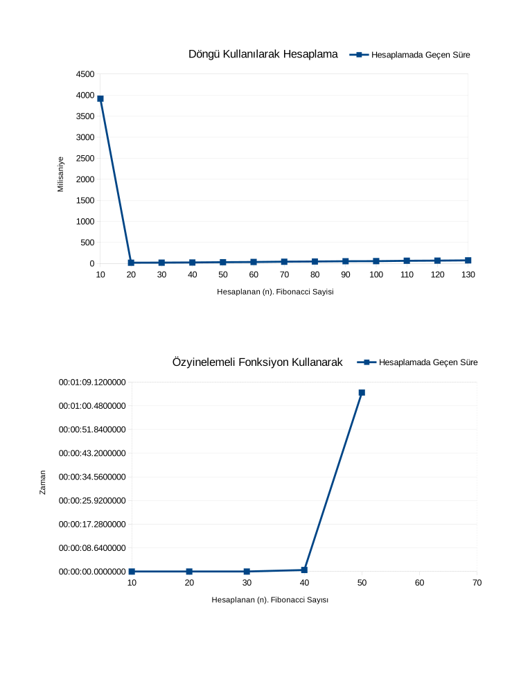

## Fibonacci Dizisi
Üniversite dersinde örnek amaçlı.

Bir kere çalıştırılıp elde edilen sonuç:

###Notlar: 
* Süre ölçülürken sistemde çalışan diğer programlar sonucu etkilemiş olabilir.
* Ortalama değil tek seferde elde edilen sonuçlardır.
* Özyinelemeli olarak çalışan programın bitmesi beklenmemiştir (çok zaman alması sebebiyle).

###Çalıştırılan ortam:
x86_64 GNU/Linux
Kernel 3.18.6
Mono JIT compiler version 3.12.0
Mono C# compiler version 3.12.0.0
